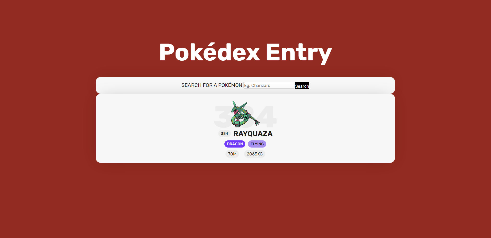

# PokéApi Connection

This is an app made to practice public APIs connections. On this app you can search for
a pokémon by name or id and you will get an entry with the infromation of that pokémon



## Getting started

To get started with the app, clone the repo and then install the needed gems:

```
$ gem install bundler -v 2.3.14
$ bundle _2.3.14_ install
```

Next, migrate the database:

```
$ rails db:migrate
```

Finally, run the test suite to verify that everything is working correctly:

```
$ rails test
```

If the test suite passes, you'll be ready to run the app in a local server:

```
$ rails server
```
